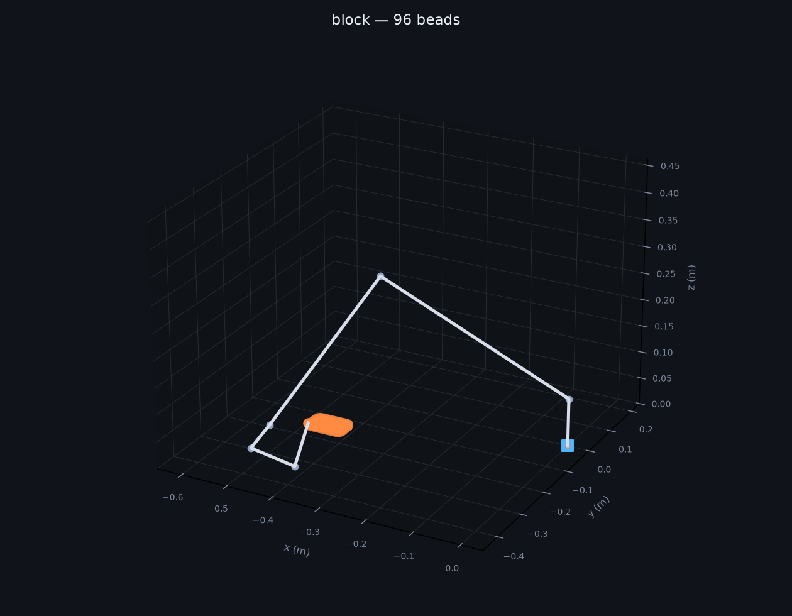

# waam-planner

**Turn a 3D model into arm trajectories for robotic metal deposition — refusing the moves that would crash.**


```bash
python build.py --shape block --video docs/build.mp4
```

```
shape   : block, 12 mm tall
bead    : 6.0 mm wide, 2.0 mm layers, 4.2 mm stepover
sliced  : 6 layers

96 beads, 1011 waypoints, 6.81 m of deposition
no rejections
```

---

## The problem

Wire-arc additive manufacturing prints metal by welding it: a torch lays down
molten beads, layer on layer. Mount that torch on a six-axis arm instead of a
gantry and it can reach angles a gantry cannot — but now something has to decide
what all six joints do, thousands of times, for one part.

Two things make that harder than it sounds:

**A weld bead is ~6 mm wide, not 0.4 mm.** Slicers written for plastic inset
contours by the wrong amount and space infill for a nozzle that does not exist.

**A solution can be geometrically right and physically useless.** The maths
says the torch reaches the point — through a joint past its limit, or with the
elbow inside the part you just built.

## The solution

Slice → plan paths → solve inverse kinematics → **check every waypoint before it
becomes motion**:

| check | what it catches |
|---|---|
| `reach` | IK converged, but not to the requested point |
| `limits` | a joint ended outside its travel |
| `collision` | a link passes through already-deposited metal |
| `jump` | the solution flipped to a different arm configuration mid-bead |

`jump` is the subtle one. A six-axis arm reaches the same point several ways; if
consecutive waypoints land in different branches, the arm swings through a large
reconfiguration **with the arc lit**. Each solve is seeded from the previous one
to keep it in one branch, and this catches what slips through.

Nothing is dropped silently — every refusal is reported with a reason:

```
$ python build.py --shape tower --height 0.13 --origin -0.40 -0.10 0
643 beads, 4363 waypoints, 29.28 m of deposition
570 points rejected: 570x collision

$ python build.py --origin -1.60 -0.15 0
0 beads, 0 waypoints, 0.00 m of deposition
1011 points rejected: 1011x reach
```

## The maths

- **Forward kinematics** — Denavit-Hartenberg parameters, one 4×4 transform per
  joint, multiplied in order
- **Jacobian** — `z_i × (p_tool − p_i)` per column; tested against finite
  differences
- **Inverse kinematics** — damped least squares. Plain pseudo-inverse blows up
  near singularities, where an ill-conditioned Jacobian asks for enormous joint
  velocities; damping bounds the step at a small cost in accuracy
- **Bead geometry** — stepover is `width × (1 − overlap)`. Beads are roughly
  parabolic, so butting them edge to edge leaves valleys that compound over
  layers; ~30% overlap is the usual compromise

Fill direction rotates each layer, so seams do not stack into one weak plane.

## Run it

```bash
pip install -r requirements.txt

python build.py                                       # 90×60×12 mm block
python build.py --shape ring --height 0.04
python build.py --shape tower --height 0.06 --plot docs/plan.png
python build.py --bead-width 0.008 --overlap 0.4      # different torch

pytest tests/ -q                                      # 22 passed
```

Shapes: `block`, `tower`, `ring`, `plate`. `--origin` places the work relative
to the arm base — move it too far and every waypoint is refused, which is the
point.

## What's in it

| | |
|---|---|
| `waam/arm.py` | DH kinematics, Jacobian, damped least-squares IK |
| `waam/slicing.py` | layers, contour inset, alternating-direction infill |
| `waam/planner.py` | IK over every path point + the four checks |
| `waam/viz.py` | 3-D plots and build animation |
| `tests/` | 22 tests — kinematics against finite differences, not recorded output |


