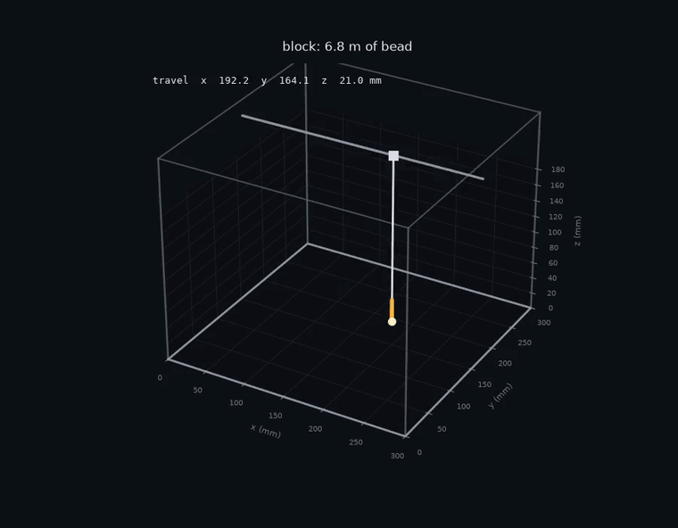
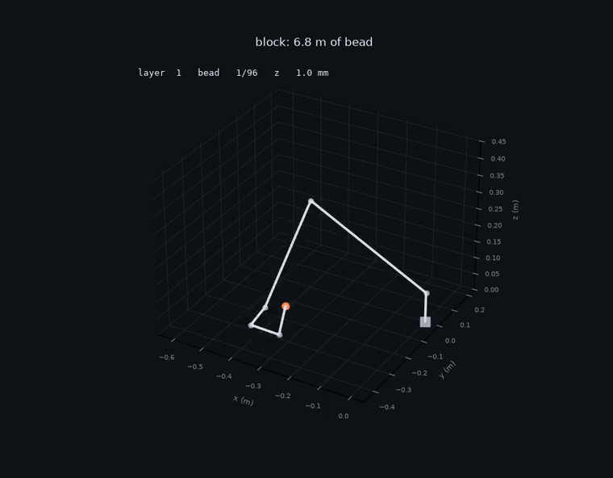

# waam-planner

**Slice a part, plan the weld beads, and drive a metal 3D printer — for a cheap gantry or a robot arm.**



```bash
python build.py --shape block --gcode block.gcode
```

```
machine : gantry
shape   : block, 12 mm tall
bead    : 6.0 mm wide, 2.0 mm layers, 4.2 mm stepover
sliced  : 6 layers

96 beads, 6.82 m of deposition, 18 min estimated
no rejections

wrote block.gcode (777 lines)
```

---

## What this is for

You can 3D print steel with a **MIG welder on a RepRap frame**, for a couple of
thousand dollars. That is the machine Anzalone, Zhang, Wijnen, Sanders and
Pearce published in 2013 — plans, firmware and software all open, and the reason
metal printing is not only a $500k proposition.

The hardware is solved and freely available. **What it still needs is software
that knows it is welding, not extruding plastic.**

A weld bead is **6 mm wide**. A plastic nozzle lays **0.4 mm**. Run a normal
slicer and every number is wrong by an order of magnitude: contours inset for a
nozzle that does not exist, infill spaced fifteen times too tightly, and G-code
that never strikes an arc because plastic printers do not have one.

## What it does

**Slices for bead geometry.** Contour inset and infill spacing both derive from
bead width and overlap, not a nozzle diameter. Fill direction rotates each
layer so seams do not stack into one weak plane.

**Emits welding G-code.** `M3`/`M5` strike and kill the arc, travel between
beads lifts to a safe Z first, and every layer gets a cooling dwell — with the
arc off, because pausing with it lit burns a hole in the part.

```gcode
G0 X192.15 Y164.05 Z21.00 F3000   ; lift and travel
G0 X192.15 Y164.05 Z1.00  F3000   ; drop onto the start
M3 S250                           ; arc on, wire feed
G4 P0.4                           ; let the puddle establish
G1 X191.85 Y167.20 Z1.00  F480    ; lay the bead
```

**Refuses what would crash.** Every point is checked before it becomes motion,
and refusals are reported rather than dropped:

```
$ python build.py --origin 0.290 0.290 0
6 beads, 0.13 m of deposition
273 points rejected: 273x envelope
```

## Two machines

**Gantry** — three linear axes, like the open-source printers. No kinematics
needed: the axes *are* the coordinates. Output is G-code.

**Arm** — a torch on a six-axis robot, which is where industrial WAAM has gone,
because an arm can tilt and reach what a gantry cannot. Now the hard part is
real:

| check | what it catches |
|---|---|
| `reach` | inverse kinematics converged, but not to the requested point |
| `limits` | a joint ended outside its travel |
| `collision` | a link passes through already-deposited metal |
| `jump` | the solution flipped to a different arm configuration mid-bead |

`jump` is the subtle one. A six-axis arm reaches the same point several ways; if
consecutive waypoints land in different branches, the arm swings through a big
reconfiguration **with the arc lit**. Each solve is seeded from the previous to
stay in one branch, and this catches what slips through.



## The maths

- **Forward kinematics** — Denavit-Hartenberg parameters, one 4×4 per joint
- **Jacobian** — `z_i × (p_tool − p_i)` per column, tested against finite differences
- **Inverse kinematics** — damped least squares. A plain pseudo-inverse blows up
  near singularities, where an ill-conditioned Jacobian demands enormous joint
  velocities; damping bounds the step for a little accuracy
- **Stepover** — `width × (1 − overlap)`. Beads are roughly parabolic, so butting
  them edge to edge leaves valleys that compound over layers

## Run it

```bash
pip install -r requirements.txt   # numpy, matplotlib, mujoco

python build.py                                     # gantry, 90×60×12 mm block
python build.py --gcode part.gcode --plot m.png     # G-code + a render
python build.py --machine arm --shape tower --height 0.06
python build.py --bead-width 0.008 --overlap 0.4    # a different torch

pytest tests/ -q                                    # 29 passed
```

Shapes: `block`, `tower`, `ring`, `plate`. `--origin` places the work; put it
off the bed or out of the arm's reach and every point is refused, which is the
point.

| | |
|---|---|
| `waam/slicing.py` | layers, contour inset, alternating-direction infill |
| `waam/gantry.py` | envelope checks, move planning, G-code |
| `waam/arm.py` | DH kinematics, Jacobian, damped least-squares IK |
| `waam/planner.py` | IK over every path point, plus the four checks |
| `waam/mjcf.py`, `waam/render.py` | the machine as a MuJoCo model, and rendering |
| `waam/viz.py` | arm-mode plots |
| `tests/` | 29 tests |

<sub>The gantry this targets is the open-source metal printer from Anzalone,
Zhang, Wijnen, Sanders & Pearce, *A Low-Cost Open-Source Metal 3-D Printer*,
IEEE Access 1 (2013). Their plans and firmware are published; this is planning
software written against that class of machine.</sub>
